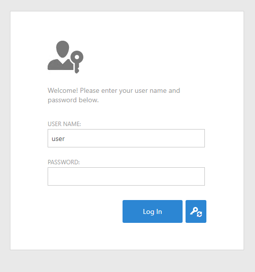
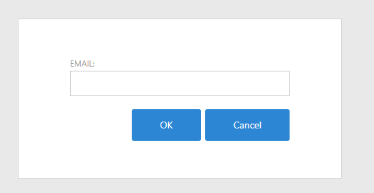

### This topic demonstrates how to extend your ASP.NET Web Forms application with recovery password

Users recovery password setting email.
If email exists the system sends email with link to reset password.
This link expires after 10 minutes.

#### Follow these steps:

In agnostic module:

- Copy in image RestorePassword.png and ***Set a build action*** embedded resource

- In ApplicationUser.cs add property Email

```csharp
        private string email;
        public string Email
        {
            get { return email; }
            set { SetPropertyValue(nameof(Email), ref email, value); }
        }

```

- Add class ChangePassword. Here I pasted script SQL Server

```xml

USE [YourDB]
GO

SET ANSI_NULLS ON
GO

SET QUOTED_IDENTIFIER ON
GO

CREATE TABLE [dbo].[ChangePassword](
	[Token] [uniqueidentifier] ROWGUIDCOL  NOT NULL,
	[DateRequest] [datetime] NOT NULL,
	[User] [nvarchar](100) NOT NULL,
 CONSTRAINT [PK_ChangePassword] PRIMARY KEY CLUSTERED 
(
	[Token] ASC
)WITH (PAD_INDEX = OFF, STATISTICS_NORECOMPUTE = OFF, IGNORE_DUP_KEY = OFF, ALLOW_ROW_LOCKS = ON, ALLOW_PAGE_LOCKS = ON, OPTIMIZE_FOR_SEQUENTIAL_KEY = OFF) ON [PRIMARY]
) ON [PRIMARY]
GO

ALTER TABLE [dbo].[ChangePassword] ADD  CONSTRAINT [DF_ChangePassword_DateRequest]  DEFAULT (getdate()) FOR [DateRequest]
GO
```

- Add class ManageUsersOnLogonController.cs and RestorePasswordParameters.cs

****In RestorePasswordParameters you need set
    <br>- urlApp variable 
    <br>- SendMail method
    <br>- change x minutes expire and body email (optional)****


- In module.cs
```csharp
        public override void Setup(XafApplication application) {
            base.Setup(application);
            // Manage various aspects of the application UI and behavior at the module level.
            application.CreateCustomLogonWindowControllers += Application_CreateCustomLogonWindowControllers; ;
        }

        private void Application_CreateCustomLogonWindowControllers(object sender, CreateCustomLogonWindowControllersEventArgs e)
        {
            XafApplication app = (XafApplication)sender;
            e.Controllers.Add(app.CreateController<ManageUsersOnLogonController>());
        }
```

- Add ChangePassword.aspx in web project
   ****<br>- change x minutes expire (optional)****

- Add web.config in configuration section:

```xml
                     
    <location path="ChangePassword.aspx">
		<system.web>
			<authorization>
				<allow users="?"/>
			</authorization>
		</system.web>
	</location>
 
```

- Run application






